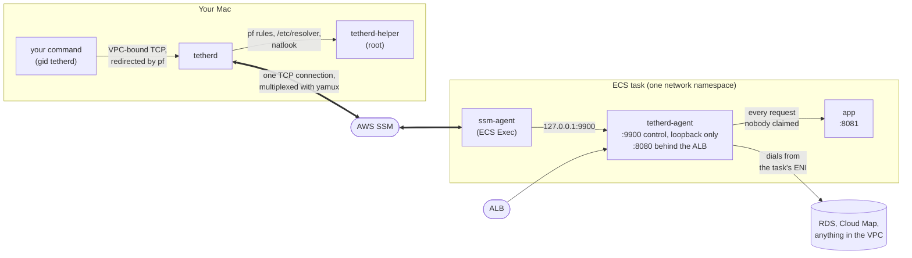
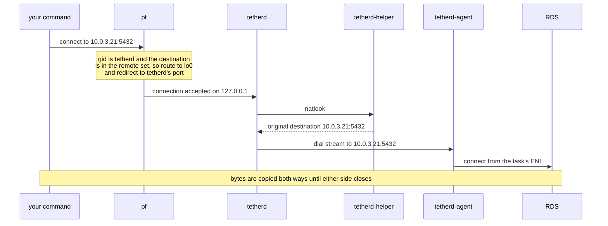
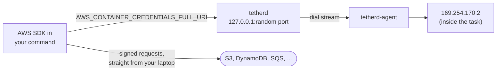
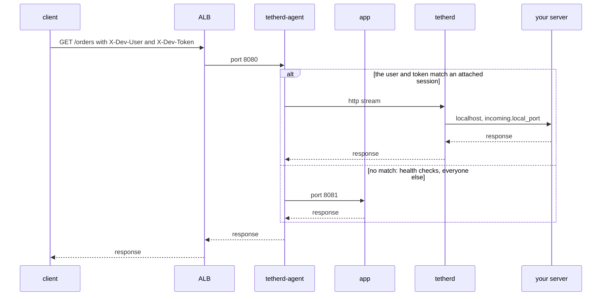

# tetherd

A mirrord-like local development environment for ECS Fargate. macOS only.

`tetherd run -- go run ./cmd/api` runs that command on your laptop as though it
were running inside your dev environment's ECS Fargate task: the environment
variables it sees are the real ones read out of the running task (secrets
already resolved), any traffic it sends into the VPC — including DNS for
VPC-internal names — leaves through the task's own network interface, the AWS
SDK inside it acts as the task's IAM role (for services outside the VPC too,
like S3), and requests that hit the ALB for you specifically, matched by a
header and a personal token, get routed to your laptop instead of to the
task.

## Install

```
brew install kyosu-1/tap/tetherd
sudo tetherd-helper install
```

`sudo tetherd-helper install` needs root because it loads the packet-filter
(`pf`) rules that capture traffic, manages entries under `/etc/resolver` so
VPC-internal domains resolve through the agent, creates the `tetherd` group
that captured processes run under, and places a setgid helper binary in a
root-owned directory — none of which Homebrew itself can do at install time,
which is why it's a separate step. It is **not** `brew services`: the
installed helper is a LaunchDaemon that this command registers with
`launchctl` directly, so `brew services start/restart tetherd` will not
control it.

Run the exact same command again after every `brew upgrade tetherd` —
`sudo tetherd-helper install` is idempotent and doubles as the upgrade step.

Releases start at `v0.4.0`. `v0.1` through `v0.3b` are development
milestones in [`docs/plans/`](docs/plans), not published releases — there was
nothing to install before this one, which is what `v0.4.0` adds.

## What your infrastructure needs

tetherd only works against a task definition that has been adapted for it;
there is no way to attach to an existing one unchanged. Before the first
`tetherd run`:

- **Build and push the `tetherd-agent` image to a registry you control.**
  Nothing in this repository publishes one, so there is no public image to
  pull. `make push-images ECR_REGISTRY=<account>.dkr.ecr.<region>.amazonaws.com`
  builds the agent (and the sample app) for `linux/amd64` and `linux/arm64`
  and pushes them there; `deploy/dev-env/` creates the ECR repositories and
  is a working example of the whole setup.
- Add a `tetherd-agent` sidecar - the image you just pushed - to the task
  definition next to your app container, with `essential: true`,
  `restartPolicy.enabled: true`, `linuxParameters.capabilities.add:
  ["SYS_PTRACE"]`, `pidMode: task`, and `TETHERD_ENV` set to the
  environment's name (e.g. `dev`).
- Point the ALB's target group at the agent's proxy port (`8080` by default)
  instead of the app's, and open that port in the app's security group. The
  agent passes every request straight through to your app unless it steals
  one for you.
- Turn on `enableExecuteCommand` on the service, and make sure the task role
  can open an SSM session (`ssmmessages:CreateControlChannel` /
  `CreateDataChannel` / `OpenControlChannel` / `OpenDataChannel`) — tetherd's
  control channel rides ECS Exec, not a VPN or an inbound port.
- Give each developer's IAM identity read access to ECS and EC2 (to discover
  tasks and the VPC's CIDR) and `ssm:StartSession` scoped to the cluster's
  tasks. No Secrets Manager, SSM Parameter Store, or KMS access is needed —
  the agent already reads the task's resolved environment for you.

[`deploy/dev-env`](deploy/dev-env) is a working Terraform example of exactly
this setup. It does not emit a `.tetherd.yml`; its `outputs` give you the
values that go in one — `cluster_name`, `service_name`, `vpc_cidr`,
`rds_endpoint`, `alb_dns_name`, `ecr_registry` and `developer_policy_arn` —
plus `tetherd_run_example`, a complete `tetherd run` command line you can
paste (`terraform output -raw tetherd_run_example`) to try the environment
before writing any config at all.
The developer IAM policy is spelled out as JSON in
[the v1 macOS design spec](docs/specs/2026-09-12-v1-macos-design.md) (§4.4),
the dev environment it belongs to is §9.1, and
[design.md](docs/design.md) (§9) explains why each change is needed.

## First run

Drop a `.tetherd.yml` in your repo root.
[`examples/.tetherd.yml`](examples/.tetherd.yml) is a working template (for
the Terraform example above), and every key is documented in
[docs/config.md](docs/config.md). At minimum it needs `target.cluster` and
`target.service`.

```
tetherd run -- <your command>
```

for example `tetherd run -- go run ./cmd/api`. tetherd finds the service's
running tasks, attaches to their agents, injects the task's environment into
the command, and starts routing traffic as described above. Ctrl-C tears all
of it down. If it doesn't attach cleanly, see `tetherd doctor` below.

## When something's wrong: `tetherd doctor`

```
tetherd doctor
```

walks the whole path from your laptop to the running task — the helper and
the setgid `tetherd-exec` wrapper, `session-manager-plugin` on your `PATH`,
your AWS identity, whether the service has an attachable task, the task
definition's `pidMode`, whether the ALB target group in front of the service
is one steal can work behind (`protocol_version HTTP1`, on the port the agent
serves), whether the agent answers and what it reports (the task's
environment, its IAM role, whether steal is wired up), the overlap
between your local network and the captured address ranges, and whether
`remote_domains` actually resolve through the agent. Each row prints one of
four marks:

- `✓` — nothing to do.
- `⚠` — tetherd works, but the row found something worth looking at.
- `✗` — tetherd will not work until this is fixed; the row also prints the
  next command to run.
- `?` — the row could not be checked at all (an earlier row already failed,
  or `--skip-agent` was given, for example) and makes no claim either way.

Only `✗` rows affect the exit code.

## How it works

tetherd is four binaries: three on your laptop and one sidecar in the task.
None of them puts your laptop inside the VPC. Both ends open an outbound
connection to AWS Systems Manager, which joins them into one ECS Exec port
forward, so there is no VPN, no inbound port on the task, and no
security-group change beyond the ALB's target port.



| Binary | Runs as | Does |
|---|---|---|
| `tetherd` | you | Attaches to the agents, starts your command with the task's environment, and serves everything your command reaches through the agent: captured connections, DNS, the task-role credential endpoint, and stolen requests. |
| `tetherd-exec` | setgid `tetherd` | Sets the real and effective gid to `tetherd`, then execs your command. pf matches on that gid and nothing else checks it, so it grants no other access. |
| `tetherd-helper` | root, as a LaunchDaemon | Apart from a version check, it does only these things, and none of them runs a command: load and clear the pf rules, write and remove `/etc/resolver` files, look up a redirected connection's original destination, and pin and clear a host route. Only members of `admin` may use them. |
| `tetherd-agent` | a sidecar in the task, with `SYS_PTRACE` | Reads the app container's environment, dials and resolves for the CLI, and sits between the ALB and the app. It never calls an AWS API. |

### Attaching

`tetherd run` lists the service's running tasks and, for each one, calls
`ssm:StartSession` with the `AWS-StartPortForwardingSession` document and
hands the result to `session-manager-plugin`, the same way
`aws ssm start-session` does (the AWS CLI itself is not needed). The forward
ends inside the task at `127.0.0.1:9900`, where the agent listens on loopback
only, out of reach of the task's ENI.

tetherd multiplexes that single TCP connection with yamux. The first stream
is the control stream, carrying JSON Lines: `hello`, then `welcome`, then a
`ping` every 5 seconds. The agent's `welcome` includes the app container's
environment and its `TETHERD_ENV`, and `tetherd run` stops right there if
that value doesn't match `target.env`. Every other stream starts with a
one-line JSON header that names its type: `dial` and `resolve` streams are
opened by the CLI, `http` streams by the agent.

tetherd attaches to every running task, because the ALB decides which task a
request lands on. The oldest task is the *primary*: its agent serves dials,
DNS and the environment. tetherd re-reads the task list every 10 seconds, so
it follows a rolling deploy instead of being left attached to stopped tasks.

### Environment

`pidMode: task` puts the app container's processes where the agent can see
them, and `SYS_PTRACE` lets it read their `/proc/<pid>/environ`. The agent
asks the task metadata endpoint which container is the app
(`TETHERD_APP_CONTAINER`, `app` by default) and reads the environment of that
container's oldest process: exactly what ECS injected at startup, with
secrets already resolved. The CLI layers your local environment, then the
task's, then `env.override`. It leaves out names that only mean something
inside the container, such as `PATH`, `HOME`, `SSL_CERT_FILE` and
`LD_LIBRARY_PATH`.

### Outbound connections



Your command is started through `tetherd-exec`, so it and every process it
starts run with gid `tetherd`. The helper loads a table and two rules into
the pf anchor `com.apple/900.tetherd`. The default `/etc/pf.conf` already
evaluates that anchor, so nothing is written to disk:

```
table <tetherd_remote> { 10.0.0.0/16 }
rdr pass on lo0 inet proto tcp from any to <tetherd_remote> -> 127.0.0.1 port <tetherd's port>
pass out route-to lo0 inet proto tcp from any to <tetherd_remote> group tetherd keep state
```

Only TCP from gid `tetherd` to an address in the remote set is redirected.
Other processes on your Mac reach the same addresses as usual, and whatever
your command sends outside the set (the internet, localhost, your LAN)
leaves through your own network. The remote set is the task VPC's CIDRs,
plus `network.remote_cidrs`, plus the prefix lists named in
`network.remote_services`, minus `network.local_cidrs`. The connection is
accepted by the kernel's own TCP stack, and the helper recovers its original
destination with `DIOCNATLOOK`, so no TCP is reimplemented in user space.

### DNS

Your command doesn't send its own DNS queries: `getaddrinfo` hands them to
`mDNSResponder`, which runs as root rather than as gid `tetherd`, so pf never
matches them. Instead, for each domain in `network.remote_domains`, the
helper writes `/etc/resolver/<domain>` pointing at tetherd's resolver on
`127.0.0.1` (port 53530 when it's free). tetherd forwards each question over
a `resolve` stream, and the agent answers with the task's own resolver. Only
A records are answered, because capture is IPv4-only. Names like RDS
endpoints already resolve publicly to private addresses inside the VPC
CIDR, so a typical setup needs no `remote_domains` at all.

### Task role



Inside the task, the SDK fetches credentials from `169.254.170.2`, an address
that exists only inside the task. tetherd doesn't capture that address.
Instead it serves an HTTP endpoint on a random loopback port, points
`AWS_CONTAINER_CREDENTIALS_FULL_URI` and the ECS metadata variables at it,
and removes `AWS_CONTAINER_CREDENTIALS_RELATIVE_URI`. It forwards each
request over a `dial` stream to `169.254.170.2` inside the task. The SDKs
check your own credentials before container credentials, so tetherd also
removes your credential variables and points `AWS_CONFIG_FILE` and
`AWS_SHARED_CREDENTIALS_FILE` at an empty file. Once the SDK has the task's
temporary credentials, it signs requests and sends them straight from your
laptop to AWS's public endpoints. That is how services outside the VPC, like
S3, work without being captured.

### Stealing requests



The agent always runs as an HTTP/1.1 reverse proxy in front of the app, and
it decides per request, because the ALB reuses its connections. It steals a
request only when `X-Dev-User` names an attached user and `X-Dev-Token` is
that user's token, compared in constant time. (Both header names are
configurable with `incoming.match`.) The agent then opens an `http` stream to
that user's CLI, which proxies the request to
`localhost:<incoming.local_port>`. Every other request goes to the app:
health checks, requests without both headers, and every WebSocket upgrade.

Sometimes a matched request never reaches your server: the session went
away, or nothing is listening on your local port. The agent then serves the
request from the app instead, replaying the body it buffered, up to 1 MiB.
If the body was larger than that, the client gets a 502. Once the request may
have reached your server, a failure is relayed as a 502 rather than replayed,
so a POST never runs twice.

### Teardown

When your command exits, or you press Ctrl-C, tetherd removes the
`/etc/resolver` files and the pf rules and closes its sessions, and the agent
sends every request to the app again. The helper treats each socket
connection as a session. If tetherd dies without cleaning up, the helper
removes that session's resolver files, host route and pf rules when the
connection drops, and it clears anything left over each time it starts.

## What this cannot do

- **No filesystem transparency.** Only the task's environment variables and
  network are available locally, never its container filesystem.
- **No UDP.** Capture works by redirecting TCP through `pf`; a UDP flow has
  no per-packet original destination to recover it from.
- **No steal for anything but HTTP/1.1.** The agent is an HTTP/1.1 reverse
  proxy sitting in front of the ALB target. Target groups that speak gRPC or
  HTTP/2, and non-HTTP protocols generally, aren't interceptable this way —
  Fargate doesn't grant the agent the `NET_ADMIN`/`NET_RAW` capabilities that
  would let it do that itself.
- **No production.** The agent refuses to start without `TETHERD_ENV` set,
  and `tetherd run` separately refuses to attach if that value doesn't match
  `target.env` in `.tetherd.yml`. Both checks have to fail independently for
  tetherd to attach somewhere it shouldn't.
- **macOS only.** The capture layer is built on `pf`, `DIOCNATLOOK`, and
  `setregid`; there is no Linux or Windows implementation.
- **The released binaries are not signed or notarized.** Homebrew quarantines
  whatever a cask downloads, so the cask strips that attribute during install;
  a binary fetched from GitHub Releases by hand keeps it, and running tetherd
  that way is not supported.
- **The root helper stays resident.** `sudo tetherd-helper install` registers a
  LaunchDaemon that runs whether or not you are using tetherd. Having launchd
  hold the socket and start the helper only on demand is the intended design
  (spec §8) and is not implemented yet.

## Trust boundary

Two things on your laptop are reachable by every local process during a
session, not just the one tetherd started for you. First, the loopback
endpoint tetherd opens to hand your child process the task's IAM credentials
is unauthenticated — its port changes every run and isn't advertised, but any
process on the machine that finds it can request those credentials, with no
per-user or per-process check. Second, the steal token is the only thing
standing between a public ALB and your laptop: a request has to carry both a
username header and your personal token to be routed to you instead of to
the task, so knowing (or guessing) a teammate's username alone gets you
nothing. Treat the `token` field in `~/.tetherd/config.yml`, and anywhere you
copy it to (a ModHeader profile, for instance), with the same care as a
credential — for the duration of a live session, it functions as one.
