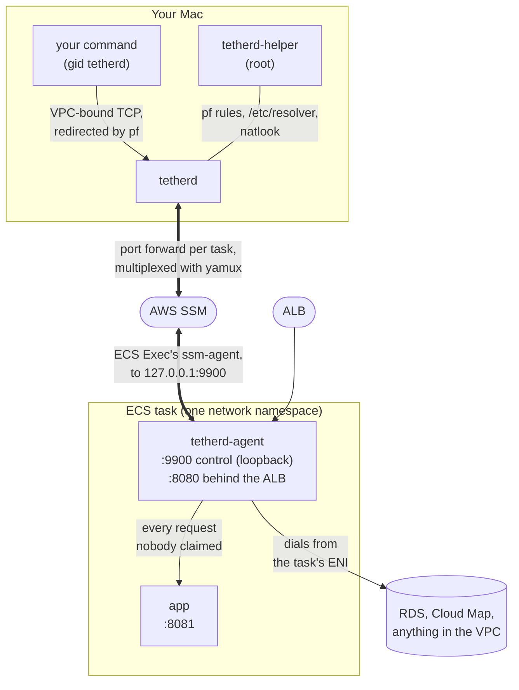
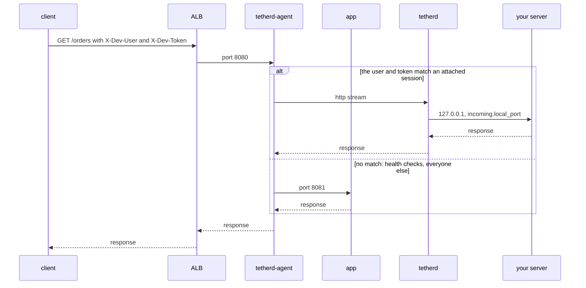

# tetherd

A mirrord-like local development environment for ECS Fargate. macOS only.

`tetherd run -- go run ./cmd/api` runs that command on your laptop as though it
were running inside your dev environment's ECS Fargate task: the environment
variables it sees are the real ones read out of the running task (secrets
already resolved), any traffic it sends into the VPC — including DNS for
VPC-internal names — leaves through the task's own network interface, the AWS
SDK inside it acts as the task's IAM role (for services outside the VPC too,
like S3), and requests that hit the ALB for you specifically, matched by a
header and a personal token, get routed to your laptop instead of to the
task.

## Install

```
brew install kyosu-1/tap/tetherd
sudo tetherd-helper install
```

`sudo tetherd-helper install` needs root because it loads the packet-filter
(`pf`) rules that capture traffic, manages entries under `/etc/resolver` so
VPC-internal domains resolve through the agent, creates the `tetherd` group
that captured processes run under, and places a setgid helper binary in a
root-owned directory — none of which Homebrew itself can do at install time,
which is why it's a separate step. It is **not** `brew services`: the
installed helper is a LaunchDaemon that this command registers with
`launchctl` directly, so `brew services start/restart tetherd` will not
control it.

Run the exact same command again after every `brew upgrade tetherd` —
`sudo tetherd-helper install` is idempotent and doubles as the upgrade step.

Releases start at `v0.4.0`. `v0.1` through `v0.3b` are development
milestones in [`docs/plans/`](docs/plans), not published releases — there was
nothing to install before this one, which is what `v0.4.0` adds.

## What your infrastructure needs

tetherd only works against a task definition that has been adapted for it;
there is no way to attach to an existing one unchanged. Before the first
`tetherd run`:

- **Build and push the `tetherd-agent` image to a registry you control.**
  Nothing in this repository publishes one, so there is no public image to
  pull. `make push-images ECR_REGISTRY=<account>.dkr.ecr.<region>.amazonaws.com`
  builds the agent (and the sample app) for `linux/amd64` and `linux/arm64`
  and pushes them there; `deploy/dev-env/` creates the ECR repositories and
  is a working example of the whole setup.
- Add a `tetherd-agent` sidecar - the image you just pushed - to the task
  definition next to your app container, with `essential: true`,
  `restartPolicy.enabled: true`, `linuxParameters.capabilities.add:
  ["SYS_PTRACE"]`, `pidMode: task`, and `TETHERD_ENV` set to the
  environment's name (e.g. `dev`).
- Point the ALB's target group at the agent's proxy port (`8080` by default)
  instead of the app's, and open that port in the app's security group. The
  agent passes every request straight through to your app unless it steals
  one for you.
- Turn on `enableExecuteCommand` on the service, and make sure the task role
  can open an SSM session (`ssmmessages:CreateControlChannel` /
  `CreateDataChannel` / `OpenControlChannel` / `OpenDataChannel`) — tetherd's
  control channel rides ECS Exec, not a VPN or an inbound port.
- Give each developer's IAM identity read access to ECS and EC2 (to discover
  tasks and the VPC's CIDR) and `ssm:StartSession` scoped to the cluster's
  tasks. No Secrets Manager, SSM Parameter Store, or KMS access is needed —
  the agent already reads the task's resolved environment for you.

[`deploy/dev-env`](deploy/dev-env) is a working Terraform example of exactly
this setup. It does not emit a `.tetherd.yml`; its `outputs` give you the
values that go in one — `cluster_name`, `service_name`, `vpc_cidr`,
`rds_endpoint`, `alb_dns_name`, `ecr_registry` and `developer_policy_arn` —
plus `tetherd_run_example`, a complete `tetherd run` command line you can
paste (`terraform output -raw tetherd_run_example`) to try the environment
before writing any config at all.
The developer IAM policy is spelled out as JSON in
[the v1 macOS design spec](docs/specs/2026-09-12-v1-macos-design.md) (§4.4),
the dev environment it belongs to is §9.1, and
[design.md](docs/design.md) (§9) explains why each change is needed.

## First run

Drop a `.tetherd.yml` in your repo root.
[`examples/.tetherd.yml`](examples/.tetherd.yml) is a working template (for
the Terraform example above), and every key is documented in
[docs/config.md](docs/config.md). At minimum it needs `target.cluster` and
`target.service`.

```
tetherd run -- <your command>
```

for example `tetherd run -- go run ./cmd/api`. tetherd finds the service's
running tasks, attaches to their agents, injects the task's environment into
the command, and starts routing traffic as described above. Ctrl-C tears all
of it down. If it doesn't attach cleanly, see `tetherd doctor` below.

## When something's wrong: `tetherd doctor`

```
tetherd doctor
```

walks the whole path from your laptop to the running task — the helper and
the setgid `tetherd-exec` wrapper, `session-manager-plugin` on your `PATH`,
your AWS identity, whether the service has an attachable task, the task
definition's `pidMode`, whether the ALB target group in front of the service
is one steal can work behind (`protocol_version HTTP1`, on the port the agent
serves), whether the agent answers and what it reports (the task's
environment, its IAM role, whether steal is wired up), the overlap
between your local network and the captured address ranges, and whether
`remote_domains` actually resolve through the agent. Each row prints one of
four marks:

- `✓` — nothing to do.
- `⚠` — tetherd works, but the row found something worth looking at.
- `✗` — tetherd will not work until this is fixed; the row also prints the
  next command to run.
- `?` — the row could not be checked at all (an earlier row already failed,
  or `--skip-agent` was given, for example) and makes no claim either way.

Only `✗` rows affect the exit code.

## How it works

tetherd adds one sidecar to the task and three binaries to your Mac. Your
laptop never joins the VPC: `tetherd` and the task's ECS Exec agent both
connect out to AWS Systems Manager, which joins them into a port forward. No
VPN, and no inbound port for the tunnel.



| Binary | Runs as | Role |
|---|---|---|
| `tetherd` | you | Attaches to the agents, starts your command with the task's environment, and relays VPC connections, DNS, credentials and stolen requests between your command and the agent. |
| `tetherd-exec` | setgid `tetherd` | Starts your command with gid `tetherd`, the group pf captures. |
| `tetherd-helper` | root (LaunchDaemon) | Loads and clears the pf rules and `/etc/resolver` files, and looks up redirected connections' original destinations. Only `admin` users can call it. |
| `tetherd-agent` | sidecar with `SYS_PTRACE` | Reads the app container's environment, opens connections and resolves names from inside the task, and proxies the ALB's requests. |

`tetherd run` attaches to every attachable running task, because the ALB can
send your request to any of them, and re-reads the task list every 10 seconds
to follow deploys. The oldest attached task is the primary: your command gets
its environment, and its agent carries outbound connections, DNS and
credential requests. If it goes away, the next oldest takes over.

### Outbound connections and DNS


`tetherd-exec` gives your command, and the processes it starts, gid `tetherd`.
The helper loads these rules into the `com.apple/900.tetherd` anchor, which
the default `/etc/pf.conf` already includes:

```
table <tetherd_remote> { 10.0.0.0/16 }
rdr pass on lo0 inet proto tcp from any to <tetherd_remote> -> 127.0.0.1 port <tetherd's port>
pass out route-to lo0 inet proto tcp from any to <tetherd_remote> group tetherd keep state
```

The remote set is the task VPC's CIDRs plus `network.remote_cidrs` and
`network.remote_services`, minus `network.local_cidrs`. The rest of your
command's traffic, and all of other processes', goes out as usual. The one
exception is `network.pin_credential_route`, which captures `169.254.170.2`
for every process on the Mac (see [docs/config.md](docs/config.md)).

Programs that use the system resolver hand lookups to `mDNSResponder`, not
your command's own process, and pf only captures TCP. So for each domain in
`network.remote_domains`, the helper writes `/etc/resolver/<domain>` pointing
at tetherd's resolver on `127.0.0.1`, which asks the agent. These files apply
to every process on the Mac while tetherd runs, and tools with their own
resolver, like `dig`, ignore them. Private RDS and ElastiCache endpoint names
already resolve to VPC addresses, so most setups don't need `remote_domains`.

### Environment and credentials

With `pidMode: task` and `SYS_PTRACE`, the agent reads the environment the app
container's first process started with, secrets already resolved. Your
command gets your local environment with those values laid over it, leaving
out container-only names like `PATH` and `SSL_CERT_FILE`, and `env.override`
over both.

The task role's credentials come from `169.254.170.2`, which exists only
inside the task. When the task has a role, tetherd serves that endpoint on a
random loopback port, forwarding each request to the task, and points
`AWS_CONTAINER_CREDENTIALS_FULL_URI` at it. It also hides your own AWS
credentials and config files from your command, since SDKs would otherwise
use them first. Your command then calls AWS directly from your laptop, signed
as the task role, so S3 and other services outside the VPC work without being
captured.

### Incoming requests



The agent is an HTTP/1.1 reverse proxy in front of the app at all times and
decides per request. A request goes to your laptop only if `X-Dev-User` names
you and `X-Dev-Token` carries your token. Everything else, including health
checks and every WebSocket upgrade, goes to the app. tetherd hands the request
to `127.0.0.1:<incoming.local_port>` (8080 unless set).

If tetherd can't deliver a request, because your session has just ended or
nothing is listening on that port, the agent serves it from the app instead,
unless its body is over 1 MiB, which gets a 502. A request your server may
already have received is never replayed: it gets a 502 if no response
arrives.

Ctrl-C, or your command exiting, removes the pf rules and resolver files. If
tetherd dies instead, the helper removes them when the connection drops, and
again the next time the helper starts.

## What this cannot do

- **No filesystem transparency.** Only the task's environment variables and
  network are available locally, never its container filesystem.
- **No UDP.** Capture works by redirecting TCP through `pf`; a UDP flow has
  no per-packet original destination to recover it from.
- **No steal for anything but HTTP/1.1.** The agent is an HTTP/1.1 reverse
  proxy sitting in front of the ALB target. Target groups that speak gRPC or
  HTTP/2, and non-HTTP protocols generally, aren't interceptable this way —
  Fargate doesn't grant the agent the `NET_ADMIN`/`NET_RAW` capabilities that
  would let it do that itself.
- **No production.** The agent refuses to start without `TETHERD_ENV` set,
  and `tetherd run` separately refuses to attach if that value doesn't match
  `target.env` in `.tetherd.yml`. Both checks have to fail independently for
  tetherd to attach somewhere it shouldn't.
- **macOS only.** The capture layer is built on `pf`, `DIOCNATLOOK`, and
  `setregid`; there is no Linux or Windows implementation.
- **The released binaries are not signed or notarized.** Homebrew quarantines
  whatever a cask downloads, so the cask strips that attribute during install;
  a binary fetched from GitHub Releases by hand keeps it, and running tetherd
  that way is not supported.
- **The root helper stays resident.** `sudo tetherd-helper install` registers a
  LaunchDaemon that runs whether or not you are using tetherd. Having launchd
  hold the socket and start the helper only on demand is the intended design
  (spec §8) and is not implemented yet.

## Trust boundary

Two things on your laptop are reachable by every local process during a
session, not just the one tetherd started for you. First, the loopback
endpoint tetherd opens to hand your child process the task's IAM credentials
is unauthenticated — its port changes every run and isn't advertised, but any
process on the machine that finds it can request those credentials, with no
per-user or per-process check. Second, the steal token is the only thing
standing between a public ALB and your laptop: a request has to carry both a
username header and your personal token to be routed to you instead of to
the task, so knowing (or guessing) a teammate's username alone gets you
nothing. Treat the `token` field in `~/.tetherd/config.yml`, and anywhere you
copy it to (a ModHeader profile, for instance), with the same care as a
credential — for the duration of a live session, it functions as one.
